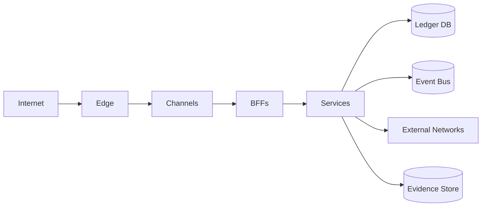

# Mapa de Implantação

A documentação define zonas lógicas, não comprova recursos provisionados.

## Bloqueios externos

- contas cloud;
- cluster e rede;
- IAM e HSM/KMS;
- certificados e DNS;
- banco, mensageria e storage;
- ambiente de continuidade;
- homologação de redes externas.
