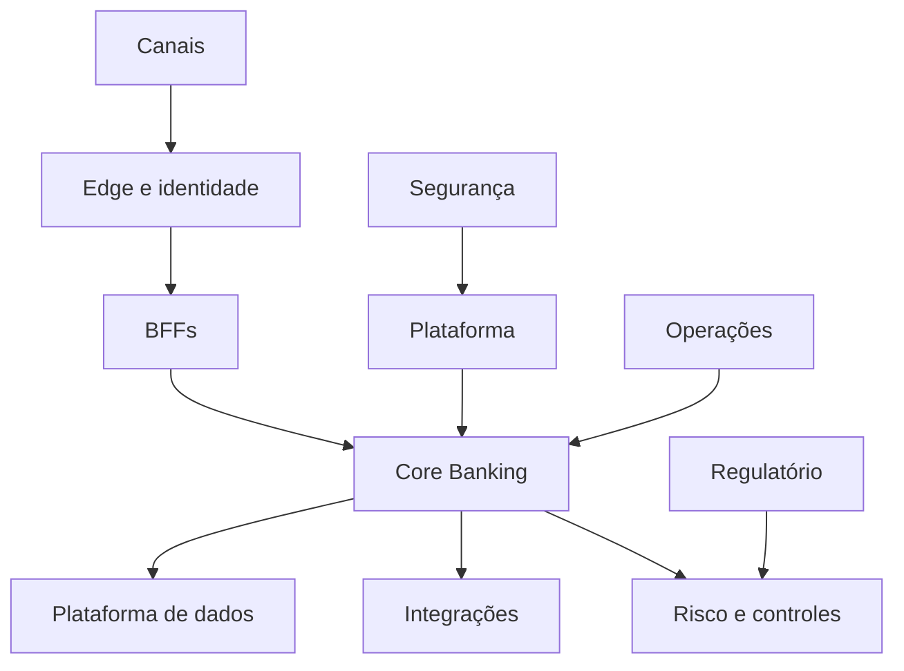

# Contexto do Sistema

O Regenera Bank é organizado como um workspace de domínios independentes por risco. Canais nunca são fonte autoritativa de saldo. BFFs compõem respostas e aplicam controles de canal. O Core Banking mantém contas, ledger, transações e reconciliação. Risco, segurança, plataforma, integrações e regulação mantêm controles próprios.

## Invariantes

- dinheiro usa unidade mínima inteira;
- efeito financeiro exige idempotência;
- estado ambíguo vira `UNKNOWN`;
- `UNKNOWN` bloqueia repetição cega;
- reversão é compensatória;
- aprovação humana externa não é simulada.
