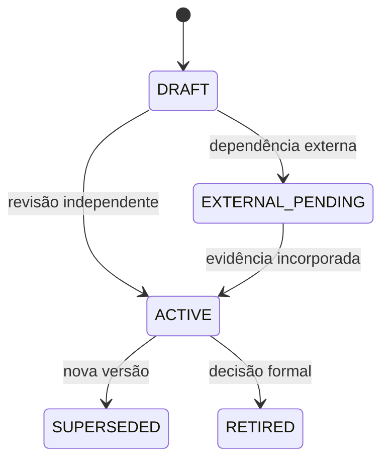

# Ciclo de Vida Documental

```mermaid
stateDiagram-v2
  [*] --> DRAFT
  DRAFT --> ACTIVE: revisão independente
  ACTIVE --> SUPERSEDED: nova versão
  ACTIVE --> RETIRED: decisão formal
  DRAFT --> EXTERNAL_PENDING: dependência externa
  EXTERNAL_PENDING --> ACTIVE: evidência incorporada
```

Transição exige registro de motivo, ator e data. Documento `ACTIVE` com revisão vencida é inválido até nova revisão.
