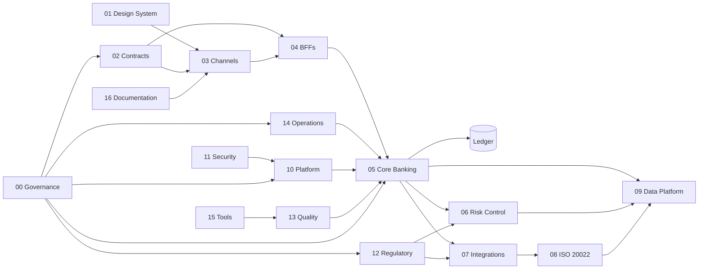

# Regenera Bank

**Estado técnico:** PRODUCT-READY para diligência, integração controlada e institucionalização  
**Data de referência dos artefatos:** 27 de junho de 2026  
**Escopo analisado:** pacote consolidado com dezessete ZIPs de domínio e respectivas árvores extraídas  
**Ativação produtiva:** condicionada às evidências externas registradas em cada domínio

Regenera Bank é um workspace bancário organizado por autoridade, risco e prova.

Canais apresentam intenção. BFFs reduzem superfície. Contratos fixam compromissos. O Core Banking decide e registra efeito financeiro. Risk Control produz decisões explicáveis. Integrations administra a perda de controle sobre redes externas. ISO 20022 preserva semântica de mensagens. Data Platform mantém contrato, qualidade e lineage. Platform Engineering, Security, Regulatory, Quality e Operations sustentam o sistema sem receber autoridade financeira por proximidade. Tools e Documentation fecham a capacidade de mudança.

A arquitetura não trata esses elementos como pastas de apoio. Cada domínio possui fonte de verdade, limite de responsabilidade, controles, testes, políticas, runbooks, evidências e bloqueios próprios.

O resultado é um sistema que distingue quatro estados que costumam ser confundidos:

1. **implementado:** existe código ou configuração executável;
2. **verificado localmente:** existem testes, validações e evidência reproduzível;
3. **aprovado institucionalmente:** existe revisão segregada e assinatura por identidade real;
4. **ativo em produção:** existem ambiente, credenciais, homologações, monitoramento e responsabilidade operacional.

A baseline comprova os dois primeiros níveis. Os dois últimos permanecem bloqueados onde dependem de fatos externos ao repositório.

Essa distinção é parte do produto.

---

## Leitura executiva

O ativo não é uma coleção de serviços. É a coerência mantida entre decisões que atravessam todo o banco.

A definição de dinheiro aparece em contratos, ledger, risco, dados, qualidade e operação sem mudar de unidade no caminho. A regra de idempotência alcança canal, BFF, core, integração, mensageria, submissão regulatória e fila operacional. O estado `UNKNOWN` é preservado sempre que uma chamada pode ter produzido efeito sem devolver resposta. A mesma disciplina de digest, manifesto, SBOM, provenance, aprovação e assinatura reaparece em todas as releases.

Não há saldo autoritativo no canal. Não há decisão financeira no BFF. Não há mutação silenciosa do ledger pelo motor de risco. Não há retry cego depois de timeout externo. Não há homologação inferida de uma configuração. Não há documento transformando intenção em fato operacional.

Esse desenho reduz um risco estrutural: um domínio assumir que outro corrigirá depois uma decisão que já produziu consequência financeira.

---

## O que PRODUCT-READY significa nesta baseline

PRODUCT-READY não significa banco em produção.

Significa que o produto foi organizado para entrar em diligência e integração sem depender de interpretação oral para explicar:

- quem possui cada decisão;
- onde reside a fonte de verdade;
- quais contratos atravessam fronteiras;
- como duplicidade é contida;
- como estado ambíguo é tratado;
- como lançamento financeiro é corrigido;
- como uma release é identificada;
- quais evidências fecham um gate;
- quais dependências externas ainda impedem ativação;
- como incidente, rollback, reconciliação e continuidade devem ser conduzidos.

Produção exige contas institucionais, IAM, HSM/KMS, certificados, rede, bancos, mensageria, observabilidade, SIEM/SOC, homologações, pareceres, assinatura criptográfica e exercícios de continuidade. O repositório registra essas dependências como bloqueios. Não as substitui por linguagem.

---

## Evidência física da baseline

O pacote consolidado contém:

* dezessete árvores de domínio, de 00 a 16;
* 1.977 arquivos nas árvores extraídas;
* 1.968 artefatos textuais legíveis entre código, contratos, políticas, schemas, testes, relatórios e evidências;
* 1.180 testes e verificações locais reportados pelos manifestos finais;
* dezessete ZIPs internos íntegros;
* dezessete digests SHA-256 coincidentes com seus arquivos laterais;
* manifests, checksums, relatórios de validação e resultados de teste por domínio;
* SBOM e provenance nos domínios em que a release produz artefato distribuível;
* bloqueios explícitos para assinatura, aprovação, homologação, ambiente e dependência externa.
Os números localizam a prova. Não substituem revisão independente.

---

## Princípios arquiteturais

### Autoridade explícita

Cada camada possui poder limitado. Interface não vira domínio. Composição não vira ledger. Operação não vira atalho. Integração não redefine regra financeira.

### Dinheiro em unidade mínima

Valores monetários usam inteiro em unidade mínima e moeda explícita. Ponto flutuante não participa de decisão financeira. Operação entre moedas diferentes falha antes de produzir resultado.

### Ledger como fonte financeira

Saldo é projeção do razão. Todo efeito financeiro nasce em lançamento balanceado. Lançamento postado não é reescrito. Correção cria nova partida compensatória.

### Idempotência durável

A chave é vinculada ao escopo, ao hash do payload e ao primeiro resultado válido. Mesma chave com outro conteúdo é conflito. Cache pode acelerar leitura; não decide efeito financeiro.

### Estado desconhecido

Timeout não prova falha. Quando não há certeza sobre o efeito externo, o estado passa a `UNKNOWN`. O fluxo automático para. Reconciliação consulta evidência e resolve o caso.

### Contrato antes da implementação privada

Dependências atravessam OpenAPI, AsyncAPI, JSON Schema, eventos versionados e catálogos. Consumidor não depende de tabela, classe interna ou comportamento não publicado.

### Evidência vinculada ao artefato

Teste, aprovação e assinatura precisam apontar para o mesmo digest. O artefato promovido deve ser o artefato testado. Evidência produzida antes da árvore final é descartada.

### Falha fechada

Ausência de identidade, assinatura, sanção, integridade, aprovação ou estado confiável não produz autorização por conveniência.

### Segregação

Solicitação, aprovação, execução e revisão não pertencem automaticamente à mesma identidade. Operações privilegiadas e releases críticas exigem maker-checker.

### Fato externo não é simulado

Certificado, HSM, parecer, protocolo, aceite regulatório, homologação, pentest, red team e exercício de continuidade só existem quando a evidência correspondente existe fora do código.

---

## Mapa do repositório

| Pacote | Domínio | Fonte de verdade | Autoridade que não recebe |
|---|---|---|---|
| `00` | Governance | decisões, owners, controles, exceções e promoção | execução financeira |
| `01` | Design System | tokens, contratos visuais e paridade | saldo, autorização ou liquidação |
| `02` | Contracts | interfaces públicas e internas versionadas | implementação de domínio |
| `03` | Channels | intenção, sessão e contexto do usuário | banco, ledger ou estado financeiro autoritativo |
| `04` | BFFs | composição e controles por canal | cálculo de saldo, fraude ou lançamento |
| `05` | Core Banking | contas, ledger, pagamentos, Pix e reconciliação | estado de interface e integração direta de canal |
| `06` | Risk Control | decisões de fraude, AML, KYC, sanções e crédito | mutação silenciosa do ledger |
| `07` | Integrations | kernel de fronteira e adaptadores externos | regra financeira e credencial persistida |
| `08` | ISO 20022 | perfis, validação e registro de mensagens | homologação ou schema oficial não fornecido |
| `09` | Data Platform | contratos, ingestão, lineage, qualidade e retenção | captura sem finalidade ou escrita no ledger |
| `10` | Platform Engineering | controles de runtime, rede, identidade e recuperação | prova de ambiente inexistente |
| `11` | Security | identidade, acesso, AppSec, detecção e resposta | aprovação por indisponibilidade |
| `12` | Regulatory | obrigação, prazo, evidência, submissão e reconciliação | interpretação jurídica não revisada |
| `13` | Quality | gates, invariantes e evidências de qualidade | promoção sem prova |
| `14` | Operations | incidentes, mudanças, filas, suporte e continuidade | bypass de maker-checker ou acesso direto ao ledger |
| `15` | Tools | automação limitada e auditável | autoridade destrutiva implícita |
| `16` | Documentation | fonte documental canônica | criação de fato operacional |

---

## Contexto do sistema



As setas representam dependência lógica ou contratual. Não significam importação direta entre todos os pacotes. A regra do workspace é depender de contrato publicado, não de implementação privada.

---

## 00 — Governance

Governance define como o sistema pode mudar sem transformar urgência em exceção permanente.

**Objetivo.** Manter responsabilidade, decisão, controle, evidência e resposta operacional sob artefatos versionados. O runtime financeiro permanece fora deste domínio; a autoridade aqui é estabelecer quem pode mudar, qual prova precisa existir, quando uma promoção deve parar e como uma exceção deixa de ser válida.

**Responsabilidade.** O pacote mantém políticas de governança documental, segurança, mudança, release, privacidade, acesso privilegiado e risco aceito. Standards estabelecem requisitos mínimos para evidência, métricas e integridade de release. ADRs fixam decisões sobre ledger append-only, idempotência durável, estado `UNKNOWN` e evidência fora do runtime. RACI, owners, control matrix, document register e regulatory traceability transformam responsabilidade em registro verificável.

**Dependências e integração.** Todos os demais domínios dependem das regras de promoção, segregação, exceção e evidência definidas aqui. Governance, por sua vez, depende dos owners de cada domínio, de revisão independente e das autoridades institucionais que não podem ser representadas por código.

**Riscos tratados.** Autoaprovação, exceção sem vencimento, documento sem owner, artefato diferente do testado, evidência produzida cedo demais, mudança emergencial sem retrospectiva, rollback sem prova e reconstrução posterior da história decisória.

**Principais ativos.** `CONTROL-MATRIX.csv`, `RACI.csv`, `DOCUMENT-REGISTER.csv`, `REGULATORY-TRACEABILITY.csv`, `GOVERNANCE-MANIFEST.yaml`, políticas, standards, seis runbooks, quatro modelos executáveis de referência, testes comportamentais, registros de autoria, rascunhos, atas e evidência de release.

**Evidência da baseline.** 72 arquivos; 24 verificações reportadas; validação em extração limpa; código de saída zero; ZIP íntegro; SHA-256 conferido. A aprovação independente e a assinatura por chave real continuam pendentes.

---

## 01 — Design System

Design System preserva significado entre Web, Android, iOS e Windows.

**Objetivo.** Manter uma fonte canônica de tokens, contratos de componente, acessibilidade e paridade de plataforma sem permitir que a camada visual invente estado financeiro.

**Responsabilidade.** Tokens de cor, tipografia, espaçamento, radius, elevation, motion, estados, temas e acessibilidade são definidos uma vez e derivados para as plataformas. O núcleo Web não depende de recurso remoto em runtime. Componentes de dinheiro, consentimento, recibo, status e estado de transação mantêm contrato visual próprio.

**Dependências e integração.** Channels consome tokens e componentes. Quality confronta acessibilidade, segurança e paridade. Governance controla owners, exceções e promoção. O domínio depende de contratos de estado publicados por Channels e Core Banking, mas não pode reinterpretá-los.

**Riscos tratados.** Divergência semântica entre plataformas, regressão de acessibilidade, asset remoto alterado sem release, mistura de versões de tokens, componente exibindo sucesso para estado ambíguo e publicação sem rollback.

**Principais ativos.** `tokens/core`, `tokens/semantic`, `tokens/platforms`, `packages/web`, saídas determinísticas em `dist`, builders e validators, documentação de arquitetura, acessibilidade, governança de tokens, paridade, segurança e release, ADRs sobre fonte canônica, núcleo agnóstico e ausência de runtime remoto.

**Evidência da baseline.** 88 arquivos; 33 testes aprovados; 86 arquivos cobertos por manifesto; saídas para quatro plataformas; build e verificação de release reportadas como aprovadas. Adoção institucional e assinatura permanecem externas.

---

## 02 — Contracts

Contracts define a superfície em que os domínios podem concordar sem conhecer a implementação uns dos outros.

**Objetivo.** Fixar estruturas, estados, erros, eventos e requisitos de compatibilidade antes que produtor e consumidor criem interpretações divergentes.

**Responsabilidade.** O pacote publica OpenAPI para Accounts, Identity, Payments e Pix; AsyncAPI para eventos financeiros; JSON Schema para dinheiro, transação, idempotência, auditoria e erro; catálogo de erros, mensagens em português e remediações. Fixtures válidas e inválidas materializam o comportamento esperado.

**Dependências e integração.** Channels e BFFs dependem das APIs. Core Banking implementa os compromissos financeiros. Integrations e ISO 20022 traduzem fronteiras externas. Data Platform consome eventos versionados. Quality verifica evolução compatível. A dependência permitida aponta para contrato; acesso direto a tabela ou classe privada permanece proibido.

**Riscos tratados.** Remoção de campo, alteração de tipo, enum não tolerado, mudança de unidade monetária, retirada do estado `UNKNOWN`, reutilização de evento com novo significado, operação mutável sem idempotência e exemplo contendo dado pessoal ou segredo.

**Estratégia de versão.** Mudança incompatível exige nova versão principal. Campo opcional e capacidade compatível entram como evolução menor. Correção que não altera decisão permanece patch. Compatibilidade é medida contra consumidores, não declarada pelo produtor.

**Principais ativos.** `contracts/openapi`, `contracts/asyncapi`, `contracts/json-schema`, `contracts/error-catalog`, `fixtures`, políticas de contrato e compatibilidade, controle de mudança, três ADRs, runbooks de breaking change e transação `UNKNOWN`, ferramentas de validação e comparação.

**Evidência da baseline.** 81 arquivos; 33 testes aprovados; validação, segurança, build e release verification em `PASS`; ZIP íntegro e digest conferido. Promoção segue bloqueada até revisão independente, ticket de mudança e assinatura real.

---

## 03 — Channels

Channels mantém a fronteira entre pessoa, dispositivo, operador, parceiro e sistema bancário.

**Objetivo.** Capturar intenção autenticada, apresentar estado e preservar contexto sem transformar cliente em fonte de verdade financeira.

**Responsabilidade.** Web Banking controla sessão, origem, CSRF, telemetria e intenção. Android e iOS mantêm núcleos nativos para validação, device binding, nonce e política de retry. Windows Operations aplica identidade corporativa, maker-checker, mascaramento e trilha verificável. Partner Portal trata mTLS, escopo, credencial e webhook com proteção contra replay.

**Dependências e integração.** O domínio consome Design System e Contracts. Toda operação segue para BFF específico. Não existe acesso direto a banco, ledger ou integração externa. Estados financeiros retornam pelos contratos publicados; `UNKNOWN` nunca é convertido em falha comum nem em sucesso visual.

**Riscos tratados.** Saldo autoritativo no cliente, repetição cega, telemetria com dado sensível, sessão sem vínculo, operação privilegiada sem dupla aprovação, credencial de parceiro comprometida, webhook reproduzido e comportamento divergente entre plataformas.

**Principais ativos.** Núcleos em TypeScript, Kotlin e Swift; `CHANNEL-REGISTRY.yaml`; `CONTROL-MATRIX.csv`; `RACI.csv`; políticas de estado, segurança, parceiro, release e privilégio; ADRs sobre fronteiras nativas, `UNKNOWN`, saldo não autoritativo, maker-checker e mTLS; SLO, threat model e runbooks.

**Evidência da baseline.** 535 arquivos; 25 gates locais reportados, entre compilações, testes de plataforma e governança; dez comandos de plataforma aprovados; 15 testes de governança aprovados; extração limpa e release verificadas. Keystore, Keychain, App Attest, Play Integrity, WAF, identidade corporativa e lojas dependem de plataforma externa.

---

## 04 — BFFs

BFFs reduzem a superfície de cada canal sem absorver autoridade do domínio financeiro.

**Objetivo.** Compor respostas, aplicar controles específicos de canal e preservar correlação, idempotência e contexto de segurança.

**Responsabilidade.** `web-bff` trata navegador, sessão e CSRF. `mobile-bff` trata attestation, device binding e nonce. `operations-bff` exige identidade corporativa, grant temporário e maker-checker. `partner-api` aplica mTLS, escopo, quota e webhook assinado. `open-finance-api` aplica consentimento, permissão, interaction ID e minimização de dados. `shared` concentra money parsing, erro, correlação, idempotência, circuit breaker, auditoria e telemetria segura.

**Dependências e integração.** BFFs dependem de Channels e Contracts; chamam APIs de Core Banking, Risk Control e Integrations. Não acessam tabelas. Não calculam saldo autoritativo. Não liquidam Pix. Não decidem fraude. O arquivo `bff-boundaries.json` torna essas proibições verificáveis.

**Riscos tratados.** Acoplamento entre canal e domínio, perda de correlation ID, comando financeiro sem idempotency key, segredo em log, retry depois de `UNKNOWN`, consentimento fora de escopo, quota ausente e privilégio operacional permanente.

**Principais ativos.** Cinco serviços de borda, biblioteca compartilhada, catálogo de erros, boundaries, services registry, ADR por canal, ADR de idempotência e `UNKNOWN`, políticas de fronteira e release, três runbooks, control matrix, owners, approvals e artefato distribuído.

**Evidência da baseline.** 96 arquivos; 47 testes aprovados; validação e segurança sem problemas reportados; 40 arquivos cobertos na verificação de release; árvore `dist` identificada por hash próprio; extração limpa aprovada. Certificados, diretório corporativo, WAF, secret manager e homologações permanecem externos.

---

## 05 — Core Banking

Core Banking é a fonte autoritativa de contas, razão, pagamentos, Pix e reconciliação.

**Objetivo.** Preservar correção financeira mesmo quando rede, operador, cache, mensageria ou provedor deixam de colaborar.

**Responsabilidade.** `Money` representa unidade mínima e moeda. `Accounts` mantém classe contábil e estado operacional. `Ledger` produz partidas dobradas e entradas imutáveis. `Holds` reduz saldo disponível sem alterar o razão. `Idempotency` mantém chave, hash, estado e resposta. `Payments` coordena débito, estado e reconciliação. `Pix` preserva EndToEndId e protege a chave recebedora. `Outbox` fecha a relação entre efeito financeiro e evento. `AuditChain` torna alteração retroativa detectável.

**Ledger.** O banco relacional é a fonte financeira primária. `journal_entries` e `ledger_postings` são protegidos contra update e delete depois da postagem. A mudança de `DRAFT` para `POSTED` só conclui quando há pelo menos duas linhas, uma moeda e igualdade entre débitos e créditos. Reversão cria entrada compensatória. Views operacionais projetam saldo e disponibilidade; não criam fonte paralela.

**Dependências e integração.** O domínio implementa Contracts e recebe comandos por BFFs. Risk Control fornece decisões de risco. Integrations e ISO 20022 tratam mundo externo. Data Platform consome eventos e reconcilia projeções. Operations atua por APIs operacionais e casos, nunca por mutação direta do razão. Platform fornece persistência, identidade, mensageria e recovery.

**Riscos tratados.** Débito duplicado, corrida de saldo, lançamento incompleto, mistura de moeda, reserva reativada, falha depois do débito, evento sem efeito financeiro, efeito sem evento, segunda reversão, chave Pix em claro, adulteração da trilha e retry de transação incerta.

**Principais ativos.** Doze módulos Kotlin, migrations PostgreSQL, JAR de domínio, políticas de integridade, release, dados, segredos e reconciliação, três ADRs, quatro runbooks, matriz de controles, inventário de origem, records de revisão, provenance, SBOM e checksums.

**Evidência da baseline.** 57 arquivos; 47 testes aprovados; build, validação, segurança e release verification em `PASS`; fonte e extração limpa idênticas. Persistência produtiva, lock relacional no adaptador, HSM, IAM, mensageria, homologação Pix e exercícios de restauração permanecem bloqueios externos.

---

## 06 — Risk Control

Risk Control transforma risco em decisão explicável, estado e evidência.

**Objetivo.** Executar controles determinísticos para fraude, AML, KYC, sanções, crédito, reconciliação, contabilidade, casos e reporte sem conceder autoridade opaca a um modelo ou fornecedor.

**Responsabilidade.** Motores separados recebem dados autorizados e produzem decisão, motivo e ação. `FraudEngine`, `AmlEngine`, `KycEngine`, `SanctionsIndex` e `CreditPolicy` não compartilham um estado implícito. `CaseManager` preserva investigação e segregação. `AccountingBook` exige partidas balanceadas. `ReconciliationEngine` classifica divergência. `AuditChain` e `ControlEvaluator` registram controle e exceção.

**Dependências e integração.** Core Banking consulta decisões e continua dono do efeito financeiro. Integrations fornece provedores e listas externas. Data Platform fornece dados com contrato e finalidade. Regulatory consome casos e reportes. Operations recebe escalonamentos. O domínio não altera silenciosamente o ledger.

**Riscos tratados.** Aprovação por indisponibilidade, sanção ignorada, override sem registro, modelo sem versão, caso crítico sem owner, contabilidade corrigida por edição, reporte sem digest e cadeia de auditoria adulterada.

**Principais ativos.** Treze módulos Python, políticas de fraude, AML/KYC/sanções, crédito, auditoria, reconciliação e release, ADRs sobre regras determinísticas, audit chain e `UNKNOWN`, runbooks de fraude material, sanções, AML, reconciliação e tampering, lineage e evidência.

**Evidência da baseline.** 59 arquivos; 54 testes aprovados; validação, segurança e release em `PASS`; árvore extraída compatível; digest conferido. Listas oficiais, bureaus, HSM, IAM, SIEM, reguladores e provedores dependem de evidência externa.

---

## 07 — Integrations

Integrations governa a fronteira em que o banco perde controle sobre tempo, resposta e disponibilidade.

**Objetivo.** Oferecer um kernel comum para chamadas externas e impedir que cada adaptador invente sua própria política de retry, idempotência, segurança e resultado ambíguo.

**Responsabilidade.** `IntegrationGateway` coordena timeout, retry e circuit breaker. `IdempotencyRegistry` protege reenvio. `OperationResult`, `Outcome` e `FailurePhase` distinguem falha anterior ao envio, falha posterior ao envio e resultado desconhecido. `EndpointPolicy`, mTLS, HMAC e redaction controlam transporte e payload. `ReconciliationBook` fecha movimentos externos por referência, valor e moeda.

**Dependências e integração.** Core Banking envia operações autorizadas. Risk Control fornece restrições. ISO 20022 trata mensagens financeiras estruturadas. Platform e Security fornecem identidade, certificado e segredo em runtime. Operations recebe outage, quebra de reconciliação e incidente de credencial. Adaptadores traduzem contrato; não decidem regra financeira.

**Registro de integrações.** O pacote mantém 14 fronteiras: SPI, DICT, Open Finance, Bacen, B3, SUSEP, SWIFT, card networks, card processor, custody, bureaus, correspondents, KYC providers e notifications. Cada entrada registra responsabilidade, efeito financeiro e evidência externa necessária. Apenas notifications aparece como referência pronta; as demais permanecem bloqueadas para ativação externa.

**Riscos tratados.** Retry depois do envio, credencial incorporada ao adaptador, timeout tratado como rejeição, webhook sem autenticidade, certificado comprometido, payload sensível em log, divergência não reconciliada e fornecedor tratado como fonte de verdade interna.

**Principais ativos.** Kernel, adapters, security, reconciliation, error model, integration registry, control matrix, ownership, políticas de transporte, terceiros, retry e release, ADRs e cinco runbooks.

**Evidência da baseline.** 95 arquivos; 56 testes aprovados; distribuição reproduzível; 50 arquivos cobertos por SHA-256; release verification aprovada. Contratos, certificados, conectividade, contingência e homologação continuam externos.

---

## 08 — ISO 20022

ISO 20022 preserva a semântica de mensagens financeiras entre sistemas.

**Objetivo.** Construir, validar, registrar, identificar e reconciliar mensagens sem confundir XML bem formado com instrução financeira válida.

**Responsabilidade.** A baseline cobre `pacs.008.001.08`, `pacs.002.001.10`, `camt.053.001.08` e `camt.054.001.08`. `parse_xml_secure` impõe limites e bloqueia DTD e entidades externas. `Iso20022Validator` aplica perfil semântico. `canonical_xml` e `message_digest` estabilizam identidade interna. `MessageRegistry` mantém idempotência e estados. `reconcile_payment_status` confronta resultado interno e externo.

**Dependências e integração.** Integrations transporta as mensagens. Core Banking fornece intenção e estado financeiro. Contracts fixa envelope e erros internos. Data Platform recebe eventos e extratos. Regulatory define obrigação e canal aplicável. O domínio não substitui certificado, rede ou homologação.

**Riscos tratados.** XXE, expansão de entidade, payload excessivo, namespace incorreto, identificador inválido, mesmo `MsgId` com conteúdo diferente, canonicalização apresentada como assinatura, timeout tratado como falha e schema sem procedência apresentado como oficial.

**Decisão relevante.** Os XSDs oficiais não estavam no pacote de origem. A baseline não os reconstruiu nem os rotulou como normativos. A ativação externa permanece bloqueada até incorporação versionada, hash, procedência e aprovação.

**Principais ativos.** Validator, builders, profiles, canonicalization, registry, reconciliation, parser seguro, fixtures válidas e hostis, testes de pacs e camt, políticas, ADRs, runbooks, governance e release interna.

**Evidência da baseline.** 138 arquivos; 48 testes aprovados; 138 arquivos comparados entre origem e extração; árvore idêntica; segurança e validação em `PASS`. XSDs oficiais, homologação e assinatura permanecem pendentes.

---

## 09 — Data Platform

Data Platform mantém dado sob contrato, origem, qualidade, finalidade e histórico.

**Objetivo.** Impedir que ingestão, repetição ou conveniência analítica transformem dado sem governança em verdade operacional.

**Responsabilidade.** `DataContract` e `ContractRegistry` definem schema e ownership. `IngestionRegistry` mantém idempotência e quarentena. `DataQualityGate` aplica regras bloqueantes. `LineageChain` registra transformação append-only. `PrivacyPolicy` classifica e mascara. `RetentionPolicy` respeita legal hold. `AccessPolicy` limita finalidade e prazo. `StreamProcessor` distingue entrega ambígua. `SCD2Table` preserva história sem sobreposição. `reconcile_financial_rows` confronta referência, valor e moeda. `ModelRegistry` controla versão e estado de modelos.

**Dependências e integração.** O domínio consome eventos versionados de Core Banking, Risk Control, Integrations e ISO 20022. Regulatory define retenção e finalidade. Security e Platform fornecem identidade, criptografia, storage e observabilidade. Operations atua sobre quebras de lineage, qualidade, privacidade e restauração.

**Riscos tratados.** Ingestão sem contrato, reprocessamento de estado `UNKNOWN`, lineage editável, descarte durante legal hold, acesso sem finalidade, SCD2 sobreposto, reconciliação agregada sem moeda, modelo sem versão e dashboard tratado como fonte financeira.

**Principais ativos.** Quatorze módulos Python, nove políticas de dados, quatro ADRs, cinco runbooks, contratos, quality rules, privacy, retention, warehouse, streaming, finance, model governance, control matrix, module registry e evidence pack.

**Evidência da baseline.** 131 arquivos; 77 testes aprovados; origem e extração sem diferenças; validação, segurança e release verification em `PASS`. Lake, storage, catálogo, broker, warehouse engine, BI, model serving e IAM dependem de ambiente real.

---

## 10 — Platform Engineering

Platform Engineering transforma infraestrutura em controles de implantação e recuperação.

**Objetivo.** Definir como identidade, rede, secrets, compute, banco, mensageria, observabilidade, backup e release podem existir sem criar autoridade não auditada.

**Responsabilidade.** `WorkloadIdentity`, `SecretLease`, `ReleaseCandidate`, `ReleaseApproval`, `ExceptionGrant`, `NetworkRule` e `KubernetesBaseline` modelam controles de plataforma. `BackupRecord`, `RestoreExercise`, `FailoverDecision` e `SLOWindow` tratam continuidade. `AuditChain` preserva a sequência das decisões. Infraestrutura como código e policies estabelecem a forma esperada de runtime.

**Dependências e integração.** Todos os domínios executáveis dependem da plataforma. Security define identidade e segredo. Quality e Tools verificam supply chain. Operations conduz incidentes e recovery. Governance controla promoção e exceções. A plataforma não prova que cloud, cluster ou região existem apenas porque há configuração.

**Riscos tratados.** Credencial estática em workload, segredo sem lease, imagem promovida por tag mutável, rede sem segmentação, exceção sem prazo, backup nunca restaurado, failover sem reconciliação, state backend improvisado e observabilidade sem owner.

**Principais ativos.** Baselines de Terraform e Kubernetes, políticas de cloud, rede, banco, secrets/KMS, observabilidade, release e backup/DR, registry de plataforma, control matrix, runbooks de região, cluster, banco, segredo, event bus e restore, source modules de controls, recovery e integrity.

**Evidência da baseline.** 55 arquivos; 44 testes aprovados; duas builds idênticas; árvore extraída idêntica; segurança sem findings reportados; release manifest com 50 payloads. Cloud, cluster, HSM/KMS, bancos, SIEM, event bus e DR continuam bloqueados por evidência externa.

---

## 11 — Security

Security mantém identidade, acesso, integridade, detecção e resposta sob controles próprios.

**Objetivo.** Fazer com que falha de autenticação, aprovação, segredo, integridade ou detecção reduza autoridade em vez de ampliá-la.

**Responsabilidade.** `Principal`, `PrivilegedGrant` e `AccessController` tratam identidade e acesso temporário. `SecretMetadata` e `KeyMetadata` tratam rotação e estado sem armazenar segredo. AppSec mantém vulnerabilidade, waiver, scan e release candidate. Detection transforma eventos em alertas. Incident mantém máquina de estados. Audit usa cadeia de hash. Governance registra assessment e exceção.

**Dependências e integração.** Channels e BFFs dependem de identidade e controles de sessão. Platform depende de workload identity, KMS e supply chain. Core, Risk, Regulatory e Operations dependem de trilha e autorização. Quality verifica pipeline. Security não substitui SOC, HSM, PKI ou pentest; define a prova necessária para aceitá-los.

**Riscos tratados.** Privilégio permanente, autoaprovação, segredo em código, rotação sem evidência, waiver sem vencimento, vulnerabilidade crítica promovida, alerta sem integridade, incidente fechado cedo, auditoria mutável e dependência externa declarada ativa sem prova.

**Principais ativos.** Nove módulos Python, oito policies, sete runbooks, quatro documentos de arquitetura, registry com controles locais e blockers externos, baselines, detection rules, risk register, control matrix, SBOM, provenance e release state.

**Evidência da baseline.** 61 arquivos; 95 testes aprovados; scan sem finding de alta confiança; 56 payloads cobertos; árvores idênticas. HSM/KMS, PKI, SIEM/SOC, pentest, red team, threat intelligence, mobile attestation e cloud posture permanecem externos.

---

## 12 — Regulatory

Regulatory transforma obrigação em estados, prazo, evidência, aprovação, submissão e reconciliação.

**Objetivo.** Evitar que calendário, relatório ou protocolo regulatório dependam de memória, planilha isolada ou dado não versionado.

**Responsabilidade.** `ObligationDefinition` e `ObligationInstance` modelam obrigação. `BusinessCalendar` calcula situação sem inventar data legal. `ReportBuilder` produz saída determinística. `ApprovalRequest` vincula decisão ao digest. `SubmissionGateway` trata idempotência e `UNKNOWN`. `EvidenceBundle` preserva artefatos. Privacy mantém acesso, retenção e solicitações de titular. Audit e governance registram controle, exceção e mudança regulatória.

**Dependências e integração.** O domínio consome eventos, casos e dados de Core Banking, Risk Control, Integrations, ISO 20022 e Data Platform. Operations trata prazos, rejeições e canais indisponíveis. Documentation mantém matriz e vigência. A interpretação jurídica permanece dependência de revisão independente.

**Cobertura.** O registry contém 14 domínios: SISBACEN, cybersecurity, cards/PCI, Pix, AML, SISORF, cloud outsourcing, UNICAD, COSIF, regulatory reporting, CVM, SUSEP, Open Finance e LGPD. Todos mantêm legal mapping pendente de revisão independente. Canais oficiais permanecem pendentes de configuração externa.

**Riscos tratados.** Data legal inventada, relatório alterado depois da aprovação, submissão repetida após timeout, protocolo sem conteúdo reconciliado, evidência sem hash, legal hold ignorado, prazo perdido sem caso e aceite regulatório presumido.

**Principais ativos.** Doze módulos Python, 25 controles, quatro schemas, oito policies, oito runbooks, cinco documentos de arquitetura, calendário, registry, test strategy, evidence bundles e release manifests.

**Evidência da baseline.** 108 arquivos; 133 testes aprovados; build determinística; 103 payloads; segurança sem finding de alta confiança; árvore limpa idêntica. Parecer jurídico, canais oficiais, protocolos, homologação e aprovação institucional permanecem pendentes.

---

## 13 — Quality

Quality decide se uma release possui prova suficiente para seguir.

**Objetivo.** Transformar contratos, invariantes, segurança, desempenho, resiliência e evidência em gates bloqueantes, não em recomendações posteriores.

**Responsabilidade.** `validate_evolution` verifica compatibilidade. `JournalRegistry` e `validate_journal` exercitam invariantes financeiras. Mutation mede força dos testes. Performance calcula percentis e confronta limites informados. Resilience modela circuit breaker e experimento. Security examina texto e workflow permissions. Accessibility audita HTML. `EvidenceChain` preserva resultados. `evaluate_gate` vincula decisão, aprovação e digest.

**Dependências e integração.** Todos os domínios entregam contratos, testes e evidência. Tools executa validações seguras. Governance define classes e aprovação. Platform fornece ambiente. Security fornece política. Operations recebe release bloqueada e regressão. Quality não cria exceção silenciosa.

**Riscos tratados.** Cobertura sem assertiva útil, mutante crítico sobrevivente, teste de carga irrepresentativo, experimento sem condição de aborto, dado real em teste, workflow com permissão excessiva, aprovação sem digest, resultado antigo reaproveitado e build contaminada por resíduo local.

**Principais ativos.** Doze módulos Python, schemas de resultado e release gate, quality policy, control matrix, threat model, external blockers, contracts, runbooks de gate, segurança, desempenho e invariante financeira, approval record e evidence results.

**Evidência da baseline.** 69 arquivos; 106 testes e checks aprovados; integridade e reprodutibilidade do ZIP em `PASS`; 67 arquivos no payload manifest. Carga externa, dispositivos reais, pentest, homologação e continuidade exigem ambiente autorizado.

---

## 14 — Operations

Operations mantém a vida operacional do banco sob estados, owners, fila e prova.

**Objetivo.** Controlar incidente, mudança, reconciliação, continuidade, handover, suporte e tarefa operacional sem permitir acesso informal ao estado financeiro.

**Responsabilidade.** Incident mantém severidade e transição. Change exige avaliação, aprovação e verificação. OperationalQueue usa lease e idempotência. Reconciliation confronta registros. Continuity registra objetivo e exercício. ShiftHandover preserva responsabilidade entre turnos. Support trata caso e refund request. Access exige actor, MFA e aprovação. RunbookRegistry mantém versão. Audit encadeia eventos. ReleaseGate fecha a promoção operacional.

**Dependências e integração.** Operations usa APIs de Core Banking, Risk, Platform, Security e Regulatory. Recebe casos de Integrations e Data Platform. Tools auxilia evidência. Documentation mantém runbooks canônicos. O operador não altera ledger, bypassa maker-checker ou fecha incidente crítico sem reconciliação.

**Riscos tratados.** Incidente encerrado sem causa e reconciliação, mudança sem verificação independente, fila duplicando efeito, grant sem prazo, passagem de turno incompleta, refund sem aprovação, continuidade declarada sem exercício e evidência operacional alterada.

**Principais ativos.** Dezessete módulos Python, schemas de incident, change, task, evidence e reconciliation, oito policies, sete runbooks, SLO, threat model, três ADRs, domain registry, control matrix, 30 evidências individuais de controle e release pack.

**Evidência da baseline.** 120 arquivos; 111 testes aprovados; 118 payloads cobertos; build reproduzível; extração limpa idêntica; validação e segurança aprovadas. IAM, SIEM, ITSM, observabilidade, mensageria, provedores financeiros e ambiente alternativo permanecem externos.

---

## 15 — Tools

Tools fornece automação sem conceder poder irrestrito à automação.

**Objetivo.** Padronizar validação, segurança, contratos, migrations, test data, SBOM, manifests e execução mantendo escopo, dry-run, path safety e auditabilidade.

**Responsabilidade.** Schema validator verifica estruturas. Secret scanner detecta assinaturas conhecidas e registra exclusões exatas. Comment gate controla resíduos. Migration validator protege ordem e publicação. Test data evita dado real. Safe executor evita shell implícito. Workspace validator contém path traversal e symlink. Release manifest e SBOM descrevem payload. Contract linter verifica OpenAPI e AsyncAPI. Audit chain registra execução.

**Dependências e integração.** Quality e todos os pipelines de domínio consomem o toolkit. Governance controla policy e exceção. Security revisa regras. Platform fornece CI e identidade. O toolkit não recebe identidade institucional, segredo ou autorização destrutiva por estar no caminho de build.

**Riscos tratados.** Command injection, path traversal, remoção fora do workspace, migration publicada alterada, segredo em fonte, exclusão ampla do scanner, ZIP aninhado, arquivo fora do manifesto, autorreferência de checksum, action sem pin e operação destrutiva sem dry-run.

**Principais ativos.** Dezoito módulos Python, CLI, safe executor, schema validator, contracts linter, migration registry, test data, secrets, comments, SBOM, release manifest, quatro schemas, registry de ferramentas, policies, ADRs, cinco runbooks e evidence pack.

**Evidência da baseline.** 115 arquivos; 134 testes aprovados; duas builds comparadas; 113 payloads cobertos; fonte e extração idênticas; segurança e validação aprovadas. CI institucional, IAM, runtime de containers, imagens assinadas e signing service permanecem externos.

---

## 16 — Documentation

Documentation é a autoridade documental canônica do workspace.

**Objetivo.** Manter arquitetura, catálogos, políticas, decisões e operação sob identidade, owner, versão, classificação, revisão e hash.

**Responsabilidade.** Cada documento ativo possui front matter controlado. O registry relaciona ID, caminho, owner, reviewers, versão, classificação, vigência, fonte de verdade e SHA-256. Documento substituído permanece rastreável com estado `SUPERSEDED`. O build gera site e dados derivados a partir do Markdown canônico.

**Dependências e integração.** Todos os domínios publicam decisões e limites. Documentation mantém system context, domain map, dependency map, channel map, deployment map, environment map, security architecture e catálogos de serviços, APIs, eventos e erros. Regulatory acrescenta dependências legais. Governance define revisão e evidência. Quality verifica links, metadados, hashes e conteúdo.

**Riscos tratados.** Documento sem owner, ID duplicado, revisão vencida, link quebrado, segredo incorporado, PDF sem procedência, versão implícita, documento substituído ainda tratado como autoridade e afirmação operacional sem evidência identificável.

**Principais ativos.** 26 documentos canônicos, registry, schemas, 25 controles, policies de governança, evidência e versionamento, processos de lifecycle e review, runbooks de documento vencido, link quebrado e mudança emergencial, site gerado, build provenance e file manifest.

**Evidência da baseline.** 97 arquivos; 113 testes aprovados; 97 arquivos confrontados; árvores idênticas; validação, segurança e release verification em `PASS`. Revisão independente, assinatura e fatos operacionais continuam externos à documentação.

---

## Fronteiras de responsabilidade

A arquitetura é orientada por proibições explícitas. Elas reduzem ambiguidade quando o sistema está degradado.

| Origem | Pode | Não pode |
|---|---|---|
| Channels | criar intenção, apresentar estado, preservar contexto | acessar banco, manter saldo autoritativo, repetir `UNKNOWN` |
| BFFs | autenticar contexto, compor resposta, aplicar controle de canal | lançar, liquidar, decidir fraude, acessar tabela |
| Core Banking | decidir estado financeiro, postar ledger, abrir reconciliação | absorver sessão de canal ou credencial de parceiro |
| Risk Control | produzir decisão, motivo, caso e evidência | editar lançamento ou aprovar por indisponibilidade |
| Integrations | traduzir contrato, transportar, classificar falha | redefinir regra financeira ou persistir segredo |
| ISO 20022 | construir e validar mensagem, registrar identidade | inventar XSD ou declarar homologação |
| Data Platform | ingerir evento contratado, manter lineage e qualidade | capturar sem finalidade, corrigir ledger |
| Platform | fornecer runtime e controles | declarar recurso externo ativo sem evidência |
| Security | autorizar, detectar, responder e preservar prova | converter ausência de sinal em aprovação |
| Regulatory | controlar obrigação e submissão | inventar data legal, canal ou aceite |
| Quality | avaliar gate e bloquear promoção | substituir aprovação institucional |
| Operations | tratar caso, incidente, mudança e continuidade | executar bypass de segregação |
| Tools | automatizar validação dentro do workspace | receber poder destrutivo implícito |
| Documentation | manter fonte canônica | criar fato operacional por declaração |

---

## Padrões empregados

### Partidas dobradas e append-only

O Core Banking usa razão relacional com partidas balanceadas. Entradas postadas e linhas contábeis são imutáveis. Correções são compensações. A escolha evita duas fontes de saldo e mantém constraints no mesmo motor que persiste o efeito financeiro.

### Transactional outbox

Pagamento, lançamento e evento precisam nascer como uma unidade lógica. A outbox separa commit financeiro de entrega assíncrona sem aceitar evento órfão ou efeito sem notificação posterior.

### Idempotency key vinculada ao payload

A chave identifica uma tentativa dentro de um escopo. O digest do payload impede que a mesma chave autorize comandos diferentes. Estados `PROCESSING`, `COMPLETED`, `UNKNOWN` e falhas controlam replay e recuperação.

### Estado `UNKNOWN`

Uma falha depois do envio não é classificada automaticamente como rejeição. `UNKNOWN` preserva a incerteza, bloqueia retry automático e cria trabalho de reconciliação.

### Maker-checker

Operação privilegiada, exceção e promoção de release separam solicitante, aprovador, executor e revisor. A identidade que produz a mudança não recebe aprovação por padrão.

### Contrato-first

OpenAPI, AsyncAPI, JSON Schema, catálogos e eventos versionados são a fronteira permitida. Implementação privada permanece substituível.

### Canonicalização e digest

JSON, XML, manifests, artefatos e cadeias de auditoria usam representações estáveis antes do hash. Canonicalização interna serve a identidade e comparação; não é apresentada como assinatura institucional.

### Hash chain

Audit, lineage e evidence chains referenciam o digest anterior. Isso torna alteração retroativa detectável. Não substitui WORM, controle de acesso, retenção nem assinatura externa.

### Fail-closed

Ausência de identidade, sanção, consentimento, integridade, aprovação ou evidência crítica bloqueia o fluxo. Indisponibilidade não é interpretada como autorização.

### Circuit breaker e retry por fase

Integrações distinguem falha antes e depois do envio. Retry só é permitido quando há prova de que o efeito não foi submetido ou quando o protocolo oferece idempotência verificável.

### Quarentena e data contracts

Registro inválido não desaparece nem contamina o dado aceito. Ingestão mantém contrato, resultado, motivo e lineage.

### SCD2

Dimensões históricas preservam intervalo de vigência e impedem sobreposição. O passado não é reescrito para simplificar consulta.

### Build limpo e reprodutível

A release é reconstruída sem resíduos locais. Domínios críticos comparam árvores, builds ou extrações. Divergência bloqueia a promoção.

---

## Principais fluxos

### 1. Intenção financeira até o ledger

1. O canal valida formato, sessão e contexto do dispositivo ou operador.
2. O BFF aplica controles específicos, cria ou preserva correlation ID e exige idempotency key.
3. O contrato define payload, moeda, valor em unidade mínima e estados possíveis.
4. Core Banking valida conta, reserva, saldo disponível e comando.
5. Risk Control fornece decisão quando aplicável.
6. Ledger cria uma entrada balanceada e imutável.
7. Pagamento, referência de idempotência e outbox são vinculados ao mesmo efeito lógico.
8. O estado retornado ao canal é derivado do domínio. O cliente não infere liquidação.

### 2. Pix e efeito externo

1. Core Banking cria intenção e EndToEndId estável.
2. A chave recebedora é mascarada; o valor bruto não entra em log genérico.
3. Integrations seleciona o adaptador e aplica política de endpoint, identidade e retry.
4. ISO 20022 constrói e valida a mensagem quando o fluxo exige padrão financeiro.
5. A resposta externa produz confirmação, rejeição ou `UNKNOWN`.
6. Confirmação conclui o estado. Rejeição pode gerar compensação.
7. `UNKNOWN` abre caso de reconciliação e bloqueia nova submissão automática.

### 3. Reconciliação de resultado ambíguo

1. O caso registra operação, motivo, referências e digest da evidência.
2. Operations recebe item com owner e prazo.
3. Integrations ou canal regulatório consulta a fonte externa autorizada.
4. Reconciliation confronta identificador, valor, moeda, versão e estado.
5. Resultado positivo conclui o efeito existente.
6. Resultado negativo produz reversão compensatória quando necessário.
7. Ausência de prova mantém o caso aberto. Pressão operacional não altera o estado.

### 4. Evento financeiro até dados

1. O commit financeiro produz evento na outbox.
2. O publisher entrega envelope versionado.
3. O consumidor deduplica pela chave publicada.
4. Data Platform valida contrato antes da ingestão.
5. Registro inválido entra em quarentena.
6. Registro aceito recebe lineage, classificação, retenção e quality checks.
7. Warehouse e relatórios preservam referência ao evento de origem.
8. Reconciliação financeira compara projeção com a fonte autoritativa; não corrige a fonte.

### 5. Decisão de risco

1. O fluxo envia dados mínimos autorizados.
2. O motor aplicável executa regra versionada.
3. A resposta contém decisão, motivo e estado.
4. Indisponibilidade de lista ou provedor não vira aprovação.
5. Caso crítico abre investigação com owner.
6. Override exige autoridade, justificativa e trilha.
7. Core Banking continua responsável por aceitar ou bloquear o efeito conforme o contrato.

### 6. Submissão regulatória

1. Uma obrigação nasce de definição versionada e fonte jurídica identificada.
2. O calendário calcula estado sem inventar prazo.
3. O relatório é produzido de forma determinística.
4. Evidências são agrupadas e identificadas por digest.
5. Maker-checker aprova o conteúdo exato.
6. A submissão usa idempotência.
7. Timeout gera `UNKNOWN`, não reenvio automático.
8. Protocolo, conteúdo e aceite são reconciliados.

### 7. Operação privilegiada

1. A identidade corporativa é validada.
2. O grant possui escopo, justificativa, ticket e expiração.
3. Maker e checker são distintos.
4. A ação ocorre por API operacional.
5. Audit chain registra solicitação, aprovação, execução e resultado.
6. Handover preserva itens ainda abertos.
7. Acesso expira sem depender de revogação manual tardia.

### 8. Incidente e continuidade

1. O incidente recebe severidade e owner.
2. Evidência inicial é preservada antes de intervenção destrutiva.
3. O runbook aplicável define autoridade e condições de aborto.
4. Mudanças emergenciais ficam vinculadas ao incidente.
5. Reconciliação verifica consequência financeira.
6. O encerramento exige revisão independente.
7. Exercícios de continuidade medem RTO e RPO informados; não os inventam.

### 9. Mudança e release

1. A mudança identifica owner, domínio, classe e contrato afetado.
2. Compatibilidade e risco são avaliados.
3. Testes e validações executam sobre árvore final.
4. O build gera artefato, SBOM, provenance, manifests e checksums.
5. A verificação confronta payload, resultados e digest.
6. A aprovação é segregada e vinculada ao hash.
7. A assinatura externa cobre o artefato distribuído.
8. Promoção reutiliza o mesmo digest. Reconstruir entre ambientes cria outra release.

---

## Pipeline de validação

Os pacotes usam implementações próprias, mas repetem a mesma ordem de responsabilidade:

1. **higiene da árvore:** resíduos de runtime, arquivos de sistema, arquivos proibidos e archives aninhados são identificados;
2. **estrutura:** diretórios obrigatórios, owners, registries, manifests e metadados são confrontados;
3. **schema e contrato:** JSON, YAML, XML, CSV, OpenAPI, AsyncAPI e schemas são validados;
4. **compatibilidade:** mudanças incompatíveis são detectadas antes do build;
5. **segurança estática:** segredos, permissões, padrões proibidos e exclusões são verificados;
6. **testes comportamentais:** invariantes do domínio são exercitadas;
7. **consistência documental:** IDs, links, versões, revisão e hashes são confrontados;
8. **decisão:** qualquer falha bloqueante encerra o pipeline com estado não aprovado.

O pipeline não usa um relatório anterior para autorizar uma árvore nova.

---

## Pipeline de build

O build transforma fonte controlada em distribuição identificável.

- entradas são ordenadas de forma determinística;
- saídas geradas são reconstruídas;
- timestamps e caminhos locais não recebem autoridade de identidade;
- payload é enumerado;
- dependências são registradas;
- SBOM e provenance são produzidos quando aplicáveis;
- cada arquivo distribuído recebe digest;
- o manifesto não inclui a si próprio no conjunto que tenta fechar;
- builds repetidos ou extrações limpas são comparados nos domínios que declaram reprodutibilidade;
- resíduo local e diferença de árvore bloqueiam a release.

O build não instala homologação, não cria identidade institucional e não produz assinatura privada.

---

## Pipeline de release

A release separa três objetos:

1. **fonte:** árvore que recebeu revisão e testes;
2. **payload:** arquivos efetivamente distribuídos;
3. **aprovação:** decisão humana vinculada ao digest do payload.

A cadeia mínima é:

```text
source tree
  -> validation results
  -> test results
  -> security report
  -> build provenance
  -> SBOM
  -> payload manifest
  -> file checksums
  -> package SHA-256
  -> independent approval
  -> external signature
  -> promotion
```

A baseline contém a cadeia técnica até o SHA-256. Onde a chave privada, a autoridade ou o ambiente não existem no pacote, o estado permanece pendente.

---

## Cadeia de evidências

Evidência não é uma pasta chamada `evidence`. É uma relação verificável.

- o resultado precisa identificar a árvore;
- o manifesto precisa enumerar o payload;
- o checksum precisa corresponder ao arquivo entregue;
- a aprovação precisa citar o digest;
- a assinatura precisa ser verificável por chave conhecida;
- a promoção precisa usar o mesmo artefato;
- o rollback precisa apontar para artefato igualmente identificado;
- a retenção precisa impedir que a prova desapareça antes da obrigação.

Hash chain torna alteração detectável. Assinatura atribui identidade. Controle de acesso limita quem escreve. Retenção preserva disponibilidade. Nenhum desses mecanismos substitui os demais.

---

## Estratégia de versionamento

### Contratos e APIs

SemVer é aplicado à responsabilidade pública. Mudança de tipo, remoção de campo, nova obrigatoriedade, alteração de unidade monetária, retirada de `UNKNOWN` ou reutilização semântica exigem nova versão principal.

### Documentos

`MAJOR` altera responsabilidade, fluxo ou controle. `MINOR` adiciona capacidade compatível. `PATCH` corrige forma sem alterar decisão. Documento substituído recebe estado próprio e referência ao sucessor.

### Design System

Patch corrige sem quebrar contrato. Minor adiciona capacidade compatível. Major altera contrato, semântica ou acessibilidade. A promoção mantém o mesmo hash entre ambientes.

### Mensagens financeiras

Perfil e versão fazem parte da identidade. `pacs.008.001.08` não é tratado como equivalente implícito de outra revisão. XSD, regra de parceiro e profile interno possuem procedência separada.

### Banco e migrations

Migration publicada não é reescrita. Mudança corretiva entra em nova migration. Alteração destrutiva exige plano de transição, rollback ou compensação e verificação de compatibilidade.

### Releases

Tag e nome ajudam navegação. O digest identifica o artefato. Qualquer reconstrução gera nova identidade, mesmo que o número de versão permaneça igual.

---

## Governança

Governança opera em cinco camadas:

1. **ownership:** cada decisão possui owner e reviewers;
2. **policy:** obrigações e critérios de bloqueio são escritos;
3. **control:** o comportamento esperado recebe ID, status e evidência;
4. **exception:** desvio possui motivo, compensação, aprovador e vencimento;
5. **release:** promoção depende de prova, segregação e assinatura.

RACI e owners distribuem responsabilidade. Control matrices conectam regra a evidência. ADRs preservam alternativas rejeitadas. Atas e históricos mantêm contexto. Runbooks registram resposta operacional. Manifests fecham o objeto entregue.

Mudança emergencial reduz janela. Não reduz prova. A revisão retrospectiva permanece obrigatória.

---

## Segurança

A arquitetura de segurança começa na identidade.

Workload usa identidade de curta duração. Operador recebe privilégio temporário. Segredo pertence a cofre externo aprovado. Chave possui metadado, rotação e estado. Artefato é promovido por digest. Telemetria usa allowlist. Evento de auditoria não transporta segredo.

A baseline implementa controles locais para IAM lógico, PAM/JIT, secrets metadata, key metadata, AppSec gate, vulnerability management, artifact integrity, detection, incident response e audit chain.

Os seguintes controles continuam dependentes de ambiente e prova externos:

- HSM/KMS real;
- PKI institucional;
- SIEM e operação SOC;
- pentest independente;
- red team;
- threat intelligence contratada;
- mobile attestation;
- cloud security posture;
- WAF, DNS e certificados;
- identidade corporativa e diretórios.

A ausência desses fatos não é ocultada por configuração.

---

## Compliance e regulatório

O repositório separa controle técnico de interpretação jurídica.

Regulatory possui catálogo, estados, evidência, maker-checker, submissão, reconciliação, privacidade e retenção. O registry não apresenta datas, layouts ou canais como vigentes sem fonte externa. Todos os mapeamentos jurídicos permanecem marcados para revisão independente.

Essa postura evita três erros frequentes:

- transformar norma lembrada em requisito vigente;
- transformar layout técnico em aceite do regulador;
- transformar protocolo enviado em obrigação cumprida.

Compliance exige prova de conteúdo, prazo, autoridade e recepção.

---

## Trilha de auditoria

A trilha aparece em vários níveis:

- Core Banking registra eventos financeiros encadeados;
- Risk Control registra decisão e caso;
- Data Platform registra lineage;
- Security registra evento, alerta e incidente;
- Regulatory vincula relatório, aprovação e submissão;
- Operations registra ação, mudança e handover;
- Tools registra execução e artefato;
- Documentation registra versão, owner e hash;
- releases registram manifest, checksums, SBOM e provenance.

As cadeias locais tornam adulteração detectável. A força probatória final depende de identidade, assinatura, retenção e controle de acesso institucionais.

---

## Estratégia de evolução

Uma capacidade nova percorre o sistema na seguinte ordem:

1. domínio e owner são identificados;
2. ADR registra decisão quando há mudança arquitetural;
3. contrato público ou evento é versionado;
4. implementação permanece dentro da fronteira do domínio;
5. testes exercitam risco, não apenas caminho feliz;
6. control matrix recebe evidência;
7. documentação canônica é atualizada;
8. build limpo produz novo payload;
9. compatibilidade é confrontada;
10. aprovação e assinatura fecham a release;
11. promoção usa o digest aprovado;
12. operação recebe runbook, observabilidade e rollback.

Essa sequência reduz o custo de evolução porque mudança não depende de memória distribuída entre pessoas.

---

## Ledger técnico da baseline

| Pacote | Domínio | Arquivos na árvore | Testes/verificações | Resultado local | SHA-256 do ZIP | Bloqueio principal |
|---:|---|---:|---:|---|---|---|
| `00` | Governance | 72 | 24 | `PASS` | `************` | revisão independente e assinatura real |
| `01` | Design System | 88 | 33 | `PASS` | `************` | revisão independente e assinatura institucional |
| `02` | Contracts | 81 | 33 | `PASS` | `************` | revisão independente, ticket de mudança e assinatura |
| `03` | Channels | 535 | 25 | `PASS` | `************` | plataformas, identidade, attestation e assinatura |
| `04` | BFFs | 96 | 47 | `PASS` | `************` | certificados, IAM, WAF, secret manager e assinatura |
| `05` | Core Banking | 57 | 47 | `PASS` | `************` | persistência produtiva, HSM/IAM, homologação e aprovação |
| `06` | Risk Control | 59 | 54 | `PASS` | `************` | listas, bureaus, IAM/SIEM e integrações oficiais |
| `07` | Integrations | 95 | 56 | `PASS` | `************` | contratos, certificados, conectividade e homologação |
| `08` | ISO 20022 | 138 | 48 | `PASS` | `************` | XSDs oficiais, homologação e assinatura |
| `09` | Data Platform | 131 | 77 | `PASS` | `************` | storage, catálogo, broker, IAM e engines gerenciados |
| `10` | Platform Engineering | 55 | 44 | `PASS` | `************` | cloud, cluster, HSM/KMS, bancos, SIEM e DR |
| `11` | Security | 61 | 95 | `PASS` | `************` | HSM, PKI, SIEM/SOC, pentest, red team e attestation |
| `12` | Regulatory | 108 | 133 | `PASS` | `************` | revisão jurídica, canais oficiais e aprovação institucional |
| `13` | Quality | 69 | 106 | `PASS` | `************` | carga externa, dispositivos, pentest e continuidade |
| `14` | Operations | 120 | 111 | `PASS` | `************` | IAM, ITSM, observabilidade, provedores e ambiente de continuidade |
| `15` | Tools | 115 | 134 | `PASS` | `************` | CI institucional, IAM, imagens assinadas e signing service |
| `16` | Documentation | 97 | 113 | `PASS` | `************` | revisão independente, assinatura e evidências operacionais externas |

**Total:** 1.977 arquivos nas árvores extraídas e 1.180 testes ou verificações reportados.

Todos os dezessete ZIPs internos foram abertos sem erro. Os digests calculados coincidem com os arquivos `.sha256` e com os manifestos finais correspondentes. O resultado técnico local não substitui aprovação institucional.

---

## Due diligence

Uma revisão técnica, jurídica ou de propriedade intelectual pode começar pelos seguintes pontos de confronto:

- árvores extraídas e ZIPs distribuídos;
- SHA-256 lateral e digest registrado no manifesto final;
- payload manifests e checksums por arquivo;
- resultados de teste, validação e security scan;
- SBOM e build provenance;
- control matrices, owners, RACI e registros de exceção;
- ADRs, alternativas rejeitadas e critérios de revisão;
- políticas, runbooks e registros de aprovação;
- declarações de procedência, atas, rascunhos e históricos incrementais;
- blockers externos e estados de promoção;
- requisitos de assinatura e aprovação independente.

O repositório não pede que a narrativa seja aceita. Ele oferece artefatos para que cada afirmação seja confrontada.

---

## Organização física completa

A árvore abaixo enumera os diretórios físicos das dezessete árvores canônicas extraídas do pacote consolidado. Arquivos principais e responsabilidades foram descritos nas seções de domínio. Diretórios `dist`, `build`, `generated` e `evidence` permanecem visíveis porque fazem parte da forma de distribuição e prova.

### `00-governance`

```text
00-governance/REGENERA-00-GOVERNANCE-10-10/
└── 00-governance/
    ├── .github/
    │   └── workflows/
    ├── architecture/
    │   └── decisions/
    ├── authorship/
    │   └── drafts/
    ├── evidence/
    │   └── release/
    ├── policies/
    ├── reference-models/
    ├── runbooks/
    ├── scripts/
    ├── standards/
    └── tests/
```

### `01-desing`

```text
01-desing/01-design-system/
├── .github/
│   └── workflows/
├── assets/
├── authorship/
│   └── RASCUNHOS/
├── dist/
│   ├── android/
│   │   └── values/
│   ├── ios/
│   ├── web/
│   └── windows/
├── docs/
│   └── ADR/
├── evidence/
│   └── logs/
├── governance/
├── packages/
│   └── web/
│       └── src/
│           ├── components/
│           └── styles/
├── tests/
├── tokens/
└── tools/
    └── lib/
```

### `02-contracts`

```text
02-contracts/REGENERA-02-CONTRACTS-10-10/
├── authorship/
│   └── RASCUNHOS/
├── contracts/
│   ├── asyncapi/
│   ├── error-catalog/
│   ├── json-schema/
│   └── openapi/
├── dist/
│   ├── asyncapi/
│   ├── error-catalog/
│   ├── json-schema/
│   └── openapi/
├── fixtures/
│   ├── invalid/
│   └── valid/
├── governance/
│   └── ADR/
├── release/
│   └── logs/
├── runbooks/
├── tests/
└── tools/
```

### `03-channels`

```text
03-channels/REGENERA-03-CHANNELS-10-10/
└── 03-channels/
    ├── .github/
    │   └── workflows/
    ├── android/
    │   ├── src/
    │   └── tests/
    ├── architecture/
    │   └── decisions/
    ├── authorship/
    │   └── drafts/
    ├── dist/
    ├── ios/
    │   ├── Sources/
    │   └── Tests/
    ├── partner-portal/
    │   ├── dist/
    │   ├── src/
    │   └── tests/
    ├── policies/
    ├── runbooks/
    ├── scripts/
    ├── shared/
    ├── tests/
    ├── web-banking/
    │   ├── dist/
    │   ├── src/
    │   └── tests/
    └── windows-operations/
        ├── dist/
        ├── src/
        └── tests/
```

### `04-bffs`

```text
04-bffs/REGENERA-04-BFFS-10-10/
├── .github/
│   └── workflows/
├── config/
├── contracts/
├── dist/
│   ├── config/
│   ├── contracts/
│   ├── docs/
│   ├── evidence/
│   ├── governance/
│   ├── packages/
│   │   ├── mobile-bff/
│   │   │   └── src/
│   │   ├── open-finance-api/
│   │   │   └── src/
│   │   ├── operations-bff/
│   │   │   └── src/
│   │   ├── partner-api/
│   │   │   └── src/
│   │   ├── shared/
│   │   │   └── src/
│   │   └── web-bff/
│   │       └── src/
│   └── release/
├── docs/
├── evidence/
├── governance/
├── packages/
│   ├── mobile-bff/
│   │   └── src/
│   ├── open-finance-api/
│   │   └── src/
│   ├── operations-bff/
│   │   └── src/
│   ├── partner-api/
│   │   └── src/
│   ├── shared/
│   │   └── src/
│   └── web-bff/
│       └── src/
├── tests/
└── tools/
```

### `05-core-bank`

```text
05-core-bank/REGENERA-05-CORE-BANKING-10-10/
├── build/
├── db/
│   └── migrations/
├── docs/
│   ├── adr/
│   ├── architecture/
│   ├── policies/
│   └── runbooks/
├── evidence/
├── governance/
│   ├── authorship/
│   ├── controls/
│   └── reviews/
├── src/
│   ├── main/
│   │   └── kotlin/
│   │       └── com/
│   │           └── regenera/
│   │               └── core/
│   └── test/
│       └── kotlin/
│           └── com/
│               └── regenera/
│                   └── core/
└── tools/
```

### `06-risk-control`

```text
06-risk-control/REGENERA-06-RISK-CONTROL-10-10/
├── authorship/
├── docs/
│   └── ADR/
├── evidence/
├── governance/
├── lineage/
├── policies/
├── runbooks/
├── src/
│   └── regenera_risk_control/
├── tests/
└── tools/
```

### `07-integrations`

```text
07-integrations/REGENERA-07-INTEGRATIONS-10-10/
├── dist/
│   └── REGENERA-07-INTEGRATIONS-10-10/
│       ├── docs/
│       │   ├── adrs/
│       │   ├── architecture/
│       │   ├── policies/
│       │   └── runbooks/
│       ├── evidence/
│       ├── governance/
│       ├── scripts/
│       ├── src/
│       │   └── regenera_integrations/
│       └── tests/
├── docs/
│   ├── adrs/
│   ├── architecture/
│   ├── policies/
│   └── runbooks/
├── governance/
├── scripts/
├── src/
│   └── regenera_integrations/
└── tests/
```

### `08-iso20022`

```text
08-iso20022/REGENERA-08-ISO20022-10-10/
├── build/
│   └── release/
│       ├── docs/
│       │   ├── adr/
│       │   ├── policies/
│       │   └── runbooks/
│       ├── evidence/
│       │   ├── generated/
│       │   └── source/
│       ├── governance/
│       ├── profiles/
│       ├── src/
│       │   └── regenera_iso20022/
│       ├── tests/
│       │   └── fixtures/
│       │       ├── invalid/
│       │       └── valid/
│       └── tools/
├── docs/
│   ├── adr/
│   ├── policies/
│   └── runbooks/
├── evidence/
│   ├── generated/
│   └── source/
├── governance/
├── profiles/
├── src/
│   └── regenera_iso20022/
├── tests/
│   └── fixtures/
│       ├── invalid/
│       └── valid/
└── tools/
```

### `09-data-platform`

```text
09-data-platform/REGENERA-09-DATA-PLATFORM-10-10/
├── .github/
│   └── workflows/
├── dist/
│   └── REGENERA-09-DATA-PLATFORM-10-10/
│       ├── .github/
│       │   └── workflows/
│       ├── docs/
│       │   ├── adrs/
│       │   ├── architecture/
│       │   ├── policies/
│       │   └── runbooks/
│       ├── evidence/
│       │   └── release/
│       ├── governance/
│       ├── scripts/
│       ├── src/
│       │   └── regenera_data_platform/
│       └── tests/
├── docs/
│   ├── adrs/
│   ├── architecture/
│   ├── policies/
│   └── runbooks/
├── evidence/
├── governance/
├── scripts/
├── src/
│   └── regenera_data_platform/
└── tests/
```

### `10-platform`

```text
10-platform/REGENERA-10-PLATFORM-10-10/
├── .github/
│   └── workflows/
├── architecture/
├── config/
├── controls/
├── evidence/
│   ├── security/
│   ├── source/
│   └── test/
├── infrastructure/
│   ├── kubernetes/
│   ├── network/
│   └── terraform/
│       └── baseline/
├── policies/
├── release/
├── runbooks/
├── src/
│   └── regenera_platform/
├── tests/
└── tools/
```

### `11-security`

```text
11-security/REGENERA-11-SECURITY-10-10/
├── .github/
│   └── workflows/
├── architecture/
├── baselines/
├── config/
├── controls/
├── evidence/
│   ├── security/
│   ├── source/
│   └── test/
├── policies/
├── release/
├── rules/
├── runbooks/
├── src/
│   └── regenera_security/
├── tests/
└── tools/
```

### `12-regulatory`

```text
12-regulatory/REGENERA-12-REGULATORY-10-10/
├── .github/
│   └── workflows/
├── architecture/
├── config/
├── controls/
├── docs/
├── evidence/
│   ├── control/
│   ├── security/
│   ├── source/
│   └── test/
├── policies/
├── release/
├── runbooks/
├── schemas/
├── src/
│   └── regenera_regulatory/
├── tests/
└── tools/
```

### `13-quality`

```text
13-quality/REGENERA-13-QUALITY-10-10/
├── .github/
│   └── workflows/
├── config/
├── contracts/
├── docs/
│   └── adr/
├── evidence/
│   ├── results/
│   └── source/
├── governance/
├── runbooks/
├── src/
│   └── regenera_quality/
├── tests/
└── tools/
```

### `14-operations`

```text
14-operations/REGENERA-14-OPERATIONS-10-10/
├── .github/
│   └── workflows/
├── docs/
│   └── ADR/
├── evidence/
│   ├── build/
│   ├── controls/
│   ├── integrity/
│   ├── release/
│   ├── security/
│   ├── source/
│   ├── test/
│   └── validation/
├── governance/
├── policies/
├── runbooks/
├── schemas/
├── src/
│   └── regenera_operations/
├── tests/
└── tools/
```

### `15-tools`

```text
15-tools/REGENERA-15-TOOLS-10-10/
├── .github/
│   └── workflows/
├── docs/
│   └── ADR/
├── evidence/
│   ├── build/
│   ├── controls/
│   ├── integrity/
│   ├── release/
│   ├── security/
│   ├── source/
│   ├── test/
│   └── validation/
├── governance/
├── policies/
├── runbooks/
├── schemas/
├── src/
│   └── regenera_tools/
├── tests/
└── tools/
```

### `16-documentation`

```text
16-documentation/REGENERA-16-DOCUMENTATION-10-10/
├── docs/
│   ├── architecture/
│   ├── catalogs/
│   ├── data/
│   ├── decision-records/
│   ├── onboarding/
│   ├── operations/
│   ├── policies/
│   ├── regulatory/
│   └── runbooks/
├── evidence/
│   └── source/
├── generated/
│   └── site/
│       ├── architecture/
│       ├── assets/
│       ├── catalogs/
│       ├── data/
│       ├── decision-records/
│       ├── onboarding/
│       ├── operations/
│       ├── policies/
│       ├── regulatory/
│       └── runbooks/
├── governance/
├── registry/
├── schemas/
├── tests/
└── tools/
```
---

## Estado da declaração

A baseline está fechada para diligência técnica e integração controlada.

Ela comprova código, contratos, controles, testes, artefatos, manifests, checksums, documentação e limites. Não comprova recursos que dependem de outra instituição, outro ambiente ou outra identidade.

A passagem para produção exige, conforme o domínio:

- revisão independente;
- assinatura criptográfica por chave real;
- aprovação institucional;
- parecer jurídico e regulatório;
- credenciais, certificados e conectividade;
- homologação de redes e provedores;
- infraestrutura provisionada e observável;
- operação de segurança;
- restauração e continuidade exercitadas;
- reconciliação em ambiente autorizado.

O ponto final da baseline não é uma promessa.

É uma fronteira verificável.
